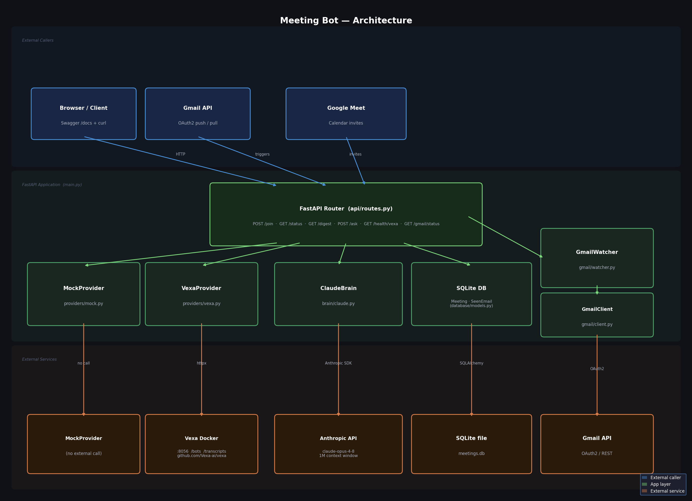

# Meeting Transcript Bot

A meeting bot that joins Google Meet calls using [Vexa.ai](https://github.com/Vexa-ai/vexa) and uses Claude Opus 4.8 to generate post-meeting digests and answer questions about the meeting. Built as a take-home assignment for CentralAgent.

---

## Demo

[Demo Video](https://drive.google.com/file/d/1uqx1Ohy2XAULRiyM-9eb8ErgSOPkxcBf/view?usp=sharing)



**End-to-end flow:**
1. Bot auto-joins a Google Meet when a calendar invite is detected in your Gmail
2. Vexa captures the full meeting transcript via a headless Chrome bot
3. Call `/digest` for an AI-generated summary, action items, and decisions — or `/ask` to ask any question about the meeting

---

## Design Decisions

### 1. Vexa abstraction with mock fallback

Vexa is the bot infrastructure layer — it handles joining Google Meet via a headless browser. Rather than coupling directly to Vexa, we built a clean `BotProvider` interface with two implementations:

- `VexaProvider` — calls the real Vexa API; bot actually joins the meeting
- `MockProvider` — returns a realistic hardcoded transcript instantly; no bot joins, but the full Claude brain layer runs end-to-end

Controlled by a single env var: `BOT_PROVIDER=vexa|mock`

### 2. Gmail watcher for automatic invite-based joining

Vexa does not expose a bot-email registration API — there is no documented endpoint for watching a Gmail inbox for calendar invites. We implemented this as a background thread: a Gmail OAuth watcher polls your inbox every 5 seconds for emails containing `meet.google.com` URLs, extracts the meeting URL, and calls `join_by_url` on Vexa automatically.

This achieves the assignment goal — the bot auto-joins any meeting you're invited to — without requiring any undocumented Vexa internals.

The `POST /meeting/join` endpoint accepts either a `url` (immediate join) or an `email` (registers intent; the Gmail watcher handles the actual join when the invite arrives).

### 3. No chunking — Claude Opus 4.8 with 1M context

We deliberately skip chunking and RAG. A 2–3 hour meeting transcript is ~50–100k tokens, well within Opus 4.8's 1M context window. The entire transcript goes in one API call.

Benefits: simpler architecture, better accuracy (no cross-chunk information loss), natural Q&A over the complete meeting record.

**Tradeoff:** switching to a smaller model (e.g. Sonnet 200k context) would require chunking or RAG. The model is configurable via `ANTHROPIC_MODEL`.

### 4. FastAPI over CLI

A CLI is a dead end for integration. FastAPI provides REST endpoints any system can call, auto-generates interactive `/docs`, and fits the CentralAgent product context — a central hub other services connect to.

### 5. SQLite with digest caching

Digests are cached in SQLite after the first `/digest` call; subsequent calls return the cached result without re-invoking Claude. This means the expensive call only happens once per meeting regardless of how many times it's requested.

---

## Setup & Running

### Quick start (mock mode — no Vexa needed)

```bash
cd meeting-bot
pip install -r requirements.txt
# Set ANTHROPIC_API_KEY in .env (BOT_PROVIDER=mock by default)
python -m uvicorn main:app --reload
```

Visit **http://localhost:8000/docs** to explore the API interactively.

### Running with real Vexa

Vexa is a self-hosted Docker service:

```bash
# Terminal 1 — start Vexa
git clone https://github.com/Vexa-ai/vexa
cd vexa
make lite        # Vexa dashboard: http://localhost:3001
                 # Vexa API:       http://localhost:8056
```

Set up a saved browser session so the bot can join as an authenticated Google account:

1. In the Vexa dashboard → **New Bot** → platform: `browser_session`
2. Click **Open Remote Browser** → sign into your Google account
3. Click **Save Browser State** → stop the bot

Then in `meeting-bot/.env`:

```
BOT_PROVIDER=vexa
VEXA_URL=http://localhost:8056
VEXA_API_KEY=your_vexa_key_here
```

### Enabling the Gmail watcher (auto-join)

The Gmail watcher detects meeting invites in your inbox and dispatches the bot automatically.

1. Go to [Google Cloud Console](https://console.cloud.google.com) → create a project → enable the **Gmail API**
2. Create OAuth2 credentials (Desktop app) → download as `credentials.json` → place it in `meeting-bot/`
3. In `.env`: set `GMAIL_ENABLED=true`
4. Restart the server — a browser window opens for Gmail consent on first run; the token is cached in `token.json` for all future runs

The watcher starts automatically on server boot. Check its status at any time:

```bash
curl http://localhost:8000/gmail/status
# or stream live updates:
curl -N "http://localhost:8000/gmail/status?stream=true"
```

### Environment variables

| Variable | Default | Description |
|---|---|---|
| `BOT_PROVIDER` | `mock` | `vexa` or `mock` |
| `ANTHROPIC_API_KEY` | required | Your Anthropic API key |
| `ANTHROPIC_MODEL` | `claude-opus-4-8` | Swappable (e.g. `claude-sonnet-4-6`) |
| `VEXA_URL` | `http://localhost:8056` | Vexa API base URL |
| `VEXA_API_KEY` | `""` | Vexa API key (required for `BOT_PROVIDER=vexa`) |
| `DATABASE_URL` | `sqlite:///./meetings.db` | SQLite path |
| `GMAIL_ENABLED` | `false` | Enable Gmail watcher for auto-join |
| `GMAIL_CREDENTIALS_FILE` | `credentials.json` | OAuth2 credentials from Google Cloud Console |
| `GMAIL_TOKEN_FILE` | `token.json` | Cached OAuth2 token (auto-created on first run) |
| `GMAIL_POLL_INTERVAL` | `5` | Seconds between inbox polls |
| `GMAIL_QUERY` | `meet.google.com newer_than:1d` | Gmail search filter |
| `GMAIL_MAX_CONCURRENT_BOTS` | `10` | Max simultaneous bot threads |

---

## API Reference

### `POST /meeting/join`

Trigger a bot to join a meeting.

**Immediate join by URL:**
```json
{ "url": "https://meet.google.com/xxx-xxxx-xxx" }
```

### `GET /meeting/{id}/status`

Poll transcript availability. When `transcript_ready` is `true`, call `/digest` or `/ask`.

### `GET /meeting/{id}/digest`

AI-generated meeting digest. Cached after the first call.

```json
{
  "meeting_id": "abc-defg-hij",
  "summary": "The team aligned on Q3 priorities...",
  "action_items": ["Bob to deliver API spec by June 20th"],
  "decisions": ["JWT chosen for authentication"]
}
```

### `POST /meeting/{id}/ask`

Natural-language Q&A over the full transcript.

```json
{ "question": "What did Alice say about the deadline?" }
```

### `GET /gmail/status`

Gmail watcher health. Add `?stream=true` for a live Server-Sent Events stream.

### `GET /meetings`

List all recent meetings (proxied from Vexa when `BOT_PROVIDER=vexa`).

---

## Running Tests

```bash
cd meeting-bot
pytest tests/ -v
```

All external calls (Vexa API, Anthropic API) are mocked — tests run without any real credentials or services. 54 tests, all passing.

---

## What's Working

| Feature | Status |
|---|---|
| Mock provider — full end-to-end flow | ✅ |
| Gmail watcher — auto-join on calendar invite | ✅ |
| Claude digest (summary + action items + decisions) | ✅ |
| Claude Q&A over full transcript | ✅ |
| Digest caching in SQLite | ✅ |
| Vexa bot join with authenticated Google session | ✅ |
| Bot named **Schrödinger** — simultaneously in the meeting and not in the meeting until observed | ✅ |
| Auto-leave after 60 s of silence | ✅ |
| SSE stream for Gmail watcher status | ✅ |
| 54 unit tests (all mocked, no external deps) | ✅ |

---

## Known Limitations & What I'd Do Next

| Component | Current limit | Production fix |
|---|---|---|
| Bot concurrency | ~10 (Vexa on localhost, ~250 MB RAM/bot) | Run Vexa fleet on cloud VMs |
| Claude latency | 15–30 s per call (synchronous) | Celery + Redis async task queue |
| API throughput | ~20 req/s (single Uvicorn worker) | gunicorn + multiple workers |
| Storage | SQLite (single writer) | PostgreSQL for multi-worker safety |
| Auth | None | API key middleware |
